# Pipeline

ignis implements the ISO 13790 monthly calculation method as a sequential 17-level pipeline. Each level is a separate Go struct that receives the outputs of earlier levels as constructor arguments — there is no shared mutable state between levels.

## Architecture

```mermaid
flowchart TD
    IN[TabulaBuildingParameters<br>from PostgreSQL]
    L1[Level 1<br>Area estimates · Insulation measures<br>Ventilation · Solar transmittance]
    L2[Level 2<br>Reference area · Storey count<br>Thermal resistances after measures]
    L3[Level 3<br>Storey area · Volume estimate<br>U-values before measures]
    L4[Level 4<br>Estimated envelope areas<br>U-values after measures]
    L5[Level 5<br>Actual U-values<br>Calc areas for all elements]
    L6[Level 6<br>Wall areas · Floor/window checks<br>Heat transmission: roofs, floors, windows]
    L7[Level 7<br>Envelope sum · Wall areas<br>Solar gains by orientation]
    L8[Level 8<br>Envelope ratio<br>Refurbished fraction · Total solar gain]
    L9[Level 9<br>Envelope plausibility check<br>Thermal bridging type · ΔU]
    L10[Level 10<br>Area plausibility check<br>Thermal bridging transmission]
    L11[Level 11<br>Total transmission heat transfer<br>coefficient H_Tr W/m²K]
    L12[Level 12<br>Temperature reduction factor<br>Time constant τ]
    L13[Level 13<br>Transmission + ventilation heat<br>transfer · Heat adaptation factor]
    L14[Level 14<br>Total heat transfer q_ht]
    L15[Level 15<br>Gain–loss ratio γ]
    L16[Level 16<br>Gain utilisation factor η]
    L17[Level 17<br>Net heating demand<br>q_h_nd kWh/m²·a]

    IN --> L1 --> L2 --> L3 --> L4 --> L5 --> L6 --> L7 --> L8
    L8 --> L9 --> L10 --> L11 --> L12 --> L13 --> L14 --> L15 --> L16 --> L17
```



## Key outputs

| Level | Key output | Unit |
|---|---|---|
| 11 | `H_Transmission` — heat transfer coefficient of building envelope | W/(m²·K) |
| 12 | `F_red_temp` — temperature reduction factor; `τ` — time constant | —; h |
| 14 | `q_ht` — total heat transfer (transmission + ventilation) | kWh/(m²·a) |
| 15 | `γ_H,gn` — gain–loss ratio (solar + internal gains vs heat transfer) | — |
| 16 | `η_H,gn` — gain utilisation factor | — |
| **17** | **`q_h_nd`** — **net annual heating energy demand** | **kWh/(m²·a)** |

## Final formula

```
q_h_nd = q_ht − η_H,gn × (q_sol + q_int)
```

Where:
- `q_ht` — total heat transfer (transmission + ventilation losses)
- `η_H,gn` — gain utilisation factor (how much of the free heat is actually useful)
- `q_sol` — solar heat gains per m²
- `q_int` — internal heat gains per m²

## Source files

Each level is a separate file in `internal/calc/`:

```
internal/
├── calc/
│   ├── calc_level_01.go  …  calc_level_17.go   # calculation levels
└── hdcp/
    └── pipeline.go                              # orchestrates all 17 levels
```

`pipeline.go` constructs each level in order, passing the outputs of earlier levels into later constructors. The pipeline returns the `q_h_nd` value from Level 17.

## Data source

All building parameters (U-values, areas, insulation thicknesses, climate conditions, solar gains, thermal bridges) come from the TABULA Excel workbook, loaded into PostgreSQL by `cmd/build_db`. The methodology follows the TABULA/EPISCOPE calculation approach defined in IEE Project TABULA (2009–2012).
